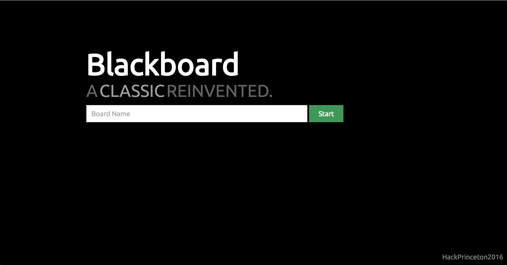
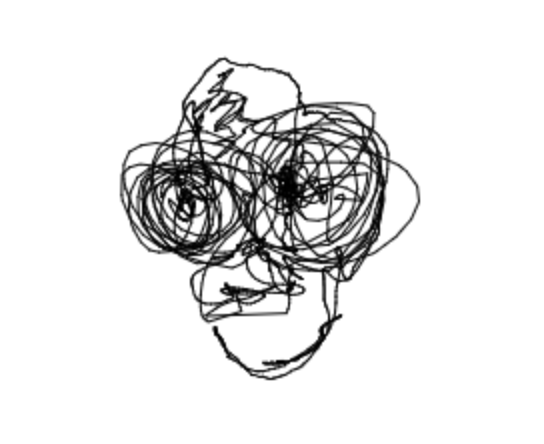

# Blackboard

This project utilizes the technology of Leap Motion to create amazing, unique drawings that capture the spontaneous creativity within everyone.

##### [Live Server](40.85.178.102)

---

## Tackling the Creative Community
Our team looked forward to designing a product for the arts community, since we thought there was a lack of community driven motion tracking in this field. The idea originally was focused on helping teachers upload their notes and achieve a "smart board". However, after using the hardware and developing the tech to work with the leap motion, we quickly realized that this platform had more opportunities in an artistic format due to the freedom of movement and expression offered by being able to simply move your hand around to draw.

## Technical Aspects ##
The application runs on the web and is written in node.js which is augmented by socket.io and express. It draws arcs on a javascript canvas using coordinates from a leap motion. The application is hosted on an azure instance in the cloud.

## The Future ##
As this was completed in a short span of time, it is far from complete. A more polished version would include the ability for only certain people to draw/write while everyone else can only view the writing. Having the ability to make channels private with password protection is also one future feature.

###### Developed at Hack Princeton &nbsp;   
